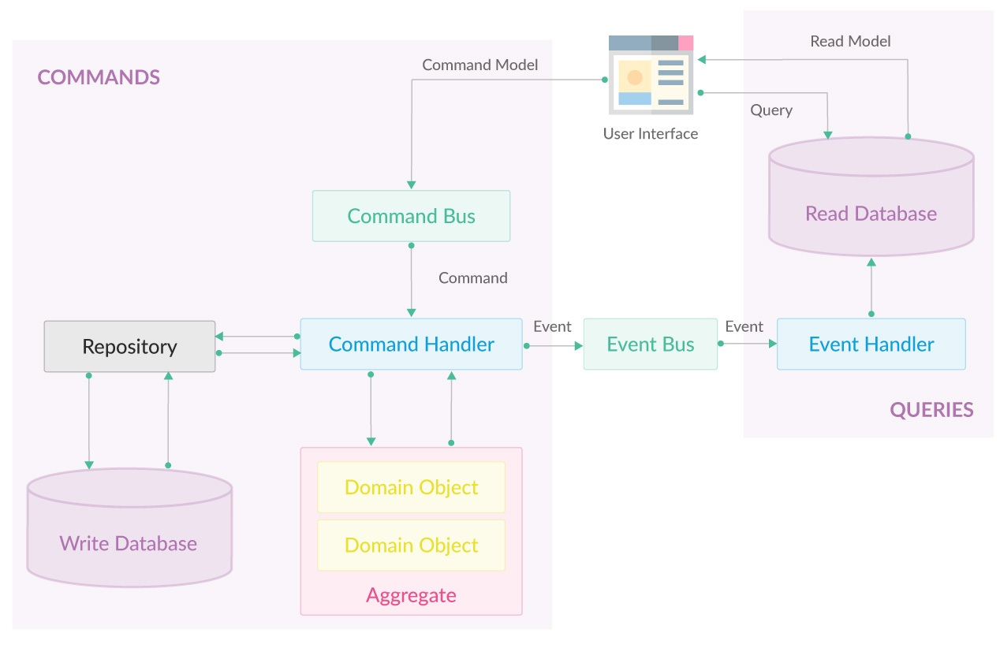
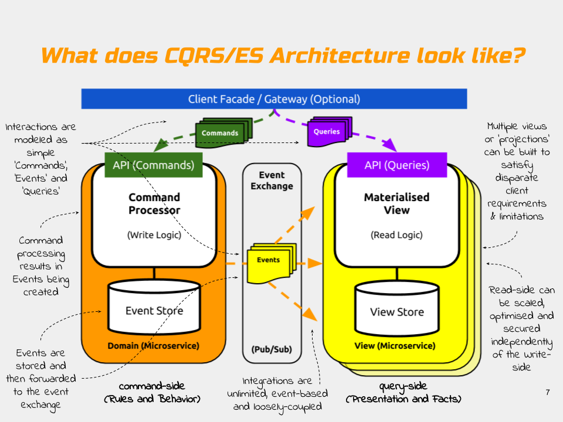

= Microservices

image:https://img.shields.io/github/license/bhuwanupadhyay/microservices.svg?style=for-the-badge["GitHub license",link="https://github.com/bhuwanupadhyay/microservices/blob/master/LICENSE"]

Developing microservices is not easy task if we don't have
right kind of expertize, clear business requirements and proper plan.

image:https://badge.waffle.io/bhuwanupadhyay/microservices.svg?columns=all&style=flat-square["Waffle.io - Columns and their card count", link="https://waffle.io/bhuwanupadhyay/microservices"]

== Project Conventions
-> Layers

image:https://docs.microsoft.com/en-us/dotnet/standard/microservices-architecture/microservice-ddd-cqrs-patterns/media/image6.png["Layers in a Domain-Driven Design Microservice", link="https://docs.microsoft.com/en-us/dotnet/standard/microservices-architecture/microservice-ddd-cqrs-patterns/ddd-oriented-microservice"]

-> CQRS





"```The purpose of software engineering is to control complexity, not to create it.```" - Dr. Pamela Zave

== Requirement Survival Guide

*Terms:* BUSINESS -> FUNCTIONS -> CONDITIONS -> FEATURES

*Development Fact:* The sooner you code; the later you finish

*Mitigation Side Effects:*

* Ubiquitous language everywhere
* Focus on tasks
* Don't start until you understand input and output of each business workflow
* Learn enough rules to implement each business process

== Eventstorming
* Think of the events in your domain
* Write description on sticky notes
* Add sticky notes to the timeline
* Now order notes as appropriate

== Development Flow

*Eventstorming* -> *Wireframes* -> *Customer Verification* -> *CQRS + DDD*

* Wireframe -> Command -> Workflow -> Persistence
* Wireframe -> Query

== Team Friendly

*Simplified Design* -> *Reduced risk of design errors* -> *Reduced need super-skills* -> managing project becomes easy.

== Software rots or decays
* Duplication
* Excess coupling
* Quick Fixes
* Hacks
* Technical Debt

== Refactoring Principles
* Keep it Simple
* Keep it DRY
* Make it Expressive
* Reduce Overall Code
* Separate Concerns
* Appropriate Level of Abstraction

== Kent Beck's Rules of Simple Desing
* Run all the tests
* Contain no duplicate code
* Express all the ideas the authors want to express
* Minimize classes and methods

"```Leave your code better than you found it.```" - Boy Scout

== Refactoring Tips
* Keep Refactoring Small
* One At A Time
* Make a Checklist
* Make a "Later" list
* Check in Frequently
* Add Test Cases
* Review the Results


== Premature Optimization

"```Premature optimization is the root of all [software] evil.```" - Donal Knuth

* Avoid over-engineering - Follow YAGNI
* Don't spend more time on refactoring than on delivering value - Avoid Gold-Plating your code

== Refactoring and Tests
* Treat Tests like Production Code
* Keep Them DRY, but Expressive
